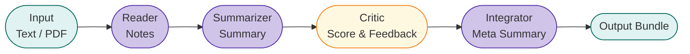

# Multi Agent Paper Analyzer

Wir orchestrieren denselben Workflow mit drei Frameworks:
- **LangChain**: Sequenziell (Reader → Summarizer → Critic → Integrator)
- **LangGraph**: Graph mit DOT Visualisierung für den Kontrollfluss
- **DSPy**: Deklarativ mit optionalem Teleprompting

---

## Projektübersicht (60 Sekunden)

### Agenten-Pipeline (konzeptionell)

**LangChain (linear)**


**Legende**
- Light blue Kästen markieren Input/Output-Daten.
- Lila Kästen sind die Verarbeitungsschritte (Lesen, Zusammenfassen, Integration).
- Gelbe Kästen zeigen die Bewertungs-/Feedback-Schritte.

**Knoten-Guide**
- `Reader`: Extrahiert strukturierte Notizen (z. B. „Key contributions“, „Methodology“).
- `Summarizer`: Verdichtet Notizen zu einer fokussierten Zusammenfassung (z. B. Ziel: „Result-focused, 80-150 Wörter“).
- `Critic`: Vergibt einen Score + Empfehlungen; liefert z. B. `critic`, `critic_loops`.
- `Integrator`: Fasst alles in `meta` zusammen und erzeugt die finale Ausgabe.

**Beispiel-Output (LangChain)**
- `notes`: „We propose a multi-agent orchestrator that splits reading, summarizing, criticising and integrating.“
- `summary`: „A multi-agent Paper Analyzer orchestrates Reader→Summarizer→Critic→Integrator to ensure coverage and coherence.“
- `critic`: „Score 0.82; expand the discussion on evaluation metrics.“
- `meta`: „Meta summary + runtime stats; `latency_s`, `reader_s`.“

---

**LangGraph (Graph + Conditional Flow)**
```mermaid
flowchart LR
  classDef io fill:#e0f2f1,stroke:#00695c,stroke-width:1px;
  classDef prep fill:#c8e6c9,stroke:#2e7d32,stroke-width:1px;
  classDef agent fill:#d1c4e9,stroke:#512da8,stroke-width:1px;
  classDef critic fill:#fff3e0,stroke:#ef6c00,stroke-width:1px;
  classDef translate fill:#fde68a,stroke:#c97700,stroke-width:1px;
  classDef keyword fill:#fef9c3,stroke:#b27c00,stroke-width:1px;
  classDef output fill:#e0f2f1,stroke:#00695c,stroke-width:1px;

  Input([Input\nRaw text / PDF]):::io
  Retriever([Retriever\nPreprocessing]):::prep
  Reader([Reader\nNotes]):::agent
  Summ([Summarizer\nSummary]):::agent
  Translator([Translator\n(DE ↔ EN) preview]):::translate
  Keyword([Keyword\nExtraction]):::keyword
  Critic([Critic\nScore & Feedback]):::critic
  Quality([Quality\nF1 Evaluation]):::critic
  Judge([Judge\nLLM rating 0-5]):::critic
  Aggregator([Aggregator\nJudge/Quality/Critic]):::agent
  Integrator([Integrator\nMeta Summary]):::agent
  Output([Output bundle\n(notes, summary, critic, meta, graph_dot)]):::output

  Input --> Retriever --> Reader --> Summ --> Translator --> Keyword --> Critic
  Critic --> Quality
  Critic -- "short/low detail" ==> Judge
  Critic -.-> Summ [label="rework (low critic)"]
  Quality --> Judge --> Aggregator --> Integrator --> Output
  Judge --> Aggregator
```

**Legende**
- Hellgrüne Kästen markieren Vorverarbeitung.
- Gelbe Kästen weisen auf Translator/Keyword-Tasks hin, die den Kontext für Judge/Aggregator anreichern.
- Orange Kästen zeigen Conditional Flows mit Entscheidungen und Scores.
- Die gestrichelte Kante signalisiert eine Schleife aus dem Critic zurück zum Summarizer.

**Knoten-Insights**
- `Retriever`: Normalisiert Text, baut `analysis_context`, füttert Reader.
- `Translator`: Erzeugt deutsch/englische Varianten (Teleprompt-geeignet) und liefert `summary_translated`.
- `Keyword`: Gibt wichtige Schlagwörter aus; `keywords`-Feld erscheint in der UI.
- `Quality`/`Judge`: Kombinieren F1/LLM-Rating; `judge` wird für Aggregation genutzt.
- `Aggregator`: Mittelt Judge, Quality, Critic und setzt `judge_aggregate`.
- `graph_dot`: Visualisierung der aktuellen Ausführung (nützlich im Workshop).

**Beispiel-Outputs (LangGraph)**
- `summary_translated`: „Wir präsentieren eine mehrstufige Orchestrierung…“ (Teleprompt-Vorschau).
- `keywords`: `["multi-agent", "evaluation", "teleprompting"]`
- `critic_score`: 0.78, `judge_score`: 4.2/5, `judge_aggregate`: 0.80
- `graph_dot`: dynamisch generierter DOT-Code für die Visualisierung.

---

**DSPy (Signatures statt explizitem Prompt)**
- Statt pro Agent einen Prompt-String zu definieren, nutzt DSPy `dspy.Signature` (Inputs/Outputs + Constraints) und generiert Prompts automatisch (`app/workflows/dspy_pipeline.py`).
- Beim optionalen Teleprompting baut der BootstrapFewShot-Optimizer auf `dev-set/dev.jsonl` mehrere Kandidaten auf, die verschiedene `target_length`- und `prompt_focus`-Tags abdecken.
- Das Ergebnis enthält die Felder `teleprompt_gain`, `teleprompt_choice`, `teleprompt_dev_examples`, `teleprompt_target_lengths`, `teleprompt_prompt_focus` und `teleprompt_summary` – plus der originale `meta`-Text wird um die Teleprompt-Zusammenfassung ergänzt.
- Beispiel-Output: `meta` endet mit „Teleprompt gain +0.072 … length=['short','medium'] … focus=['Method','Results']“, `summary` bleibt thematisch konsistent, und die Teleprompt-Metriken zeigen, wie sich die Zusammenfassung gegenüber der Basis-Signatur verbessern ließ.

### Framework-Unterschiede (warum 3 Paradigmen?)

| Framework | Paradigma | Vorteile | Nachteile | Beispiel im Projekt |
|---|---|---|---|---|
| LangChain | Sequenziell | Einfach, leicht nachvollziehbar | Kein Conditional Flow / Looping | `app/workflows/langchain_pipeline.py:run_pipeline()` |
| LangGraph | Graph-based | Flexibel, visualisierbar, Conditional Edges | Komplexer (State + Routing) | `app/workflows/langgraph_pipeline.py:_build_langgraph_workflow()` |
| DSPy | Deklarativ / Self-Improving | Automatische Prompt-Optimierung (Teleprompting), klare Signatures | Braucht Dev-Set, kann langsamer sein | `app/workflows/dspy_pipeline.py` (`dspy.Signature`, `run_pipeline()`) |

### Mini-Beispielausgabe (Form der Ergebnisse)

| Framework | Ergebnis-Felder (Auszug) | Projekt-spezifische Extras |
|---|---|---|
| LangChain | `structured`, `summary`, `critic`, `meta`, `latency_s`, `reader_s`… | — |
| LangGraph | `structured`, `summary`, `critic`, `meta`, `latency_s`, `reader_s`… | `summary_translated`, `keywords`, `critic_loops`, `graph_dot` |
| DSPy | `structured`, `summary`, `critic`, `meta`, `latency_s`, `reader_s`… | `dspy_available` (+ optional Teleprompting) |

## Schnell starten
- **Windows:** Doppelklick auf `scripts/launchers/run.bat`
- **Mac/Linux:** Doppelklick auf `scripts/launchers/run.sh` (oder `chmod +x scripts/launchers/run.sh && ./scripts/launchers/run.sh`)

Das Startskript prüft Python, legt ein virtuelles Environment an, installiert die Abhängigkeiten und startet Streamlit. Wenn `.env` neu angelegt wird, kommt eine kurze Erinnerung zum API-Key.

Mehr Details zur Einrichtung stehen in `docs/participants/START_HIER.md`.

---

## Checkliste für den Schnellstart
1. Python 3.9+ prüfen:
   ```bash
   python --version
   ```
2. Virtual Environment einrichten:
   ```bash
   python -m venv venv
   source venv/bin/activate    # Windows: venv\Scripts\activate
   ```
3. Abhängigkeiten installieren:
   ```bash
   pip install -r requirements.txt
   ```
4. API-Key setzen (falls noch nicht vorhanden):
   ```bash
   cp .env.example .env
   # dann OPENAI_API_KEY=sk-... eintragen
   ```
5. App starten:
   ```bash
   python -m streamlit run app/app.py
   ```

---

## Nutzung
- Datei hochladen (PDF/TXT) → strukturierte Notizen + Kontext
- Pipeline wählen (LangChain, LangGraph, DSPy) und Einstellungen anpassen
- „Starten“ führt die gewählte Pipeline aus
- „Alle Pipelines vergleichen“ zeigt Outputs und Metriken nebeneinander
- DSPy Teleprompt Gain vergleicht DSPy mit und ohne Teleprompting (Dev-Set erforderlich)
- Im Expander „Telemetry (CSV)“ stehen Laufzeitdaten

---

## LangGraph Highlights
- Der LangGraph-Workflow beinhaltet jetzt explizite Translator-, Keyword- und Judge-Aggregator-Nodes, die ihr im Visual Tab und im Code seht.
- Conditional Edges entscheiden auf Basis der Critic-Score bzw. Summary-Länge, ob Quality übersprungen oder der Summarizer neu gestartet wird, wodurch der Graph flexibler wird.
- Ihr könnt die Translator-/Keyword-Logik oder die Schwellenwerte im Graph-Code verändern und sofort beobachten, wie sich die Visualisierung und der Workflow verändern.

---

## Details zu DSPy
- Checkbox „DSPy optimieren“ aktiviert Teleprompting mit `dev-set/dev.jsonl`
- Das Dev-Set enthält 15 kuratierte Fälle aus verschiedenen Fachrichtungen. Zu jedem Beispiel gehören `target_length` (short/medium/long) und `prompt_focus` (Results/Method/Conclusion), damit Teleprompting sichtbar macht, wie DSPy Prompts adaptive anpasst und der Qualitäts-/Latenz-Trade-off entsteht.
- Fehlen `dspy-ai`, `litellm` oder die API-Keys, läuft eine Stub-Variante mit Dummy-Output und einem Hinweistext in `meta`, damit das UI nicht abstürzt und Teilnehmer den Mechanismus trotzdem sehen können

---

## Evaluierung
- `app/eval_runner.py` wertet `dev-set/dev.jsonl` über alle Pipelines aus und liefert ein Set an Vergleichsmessgrößen.
  - Neben dem bisherigen Unigram-F1 wird zusätzlich ROUGE-L (LCS-basiert) ermittelt.
  - Damit lässt sich zeigen: bessere Struktur/Abdeckung ≠ automatisch bessere semantische Übereinstimmung.

---

## Struktur
### Code
- `app/`: Anwendungscode
  - `app/app.py`: Streamlit-Frontend
  - `app/agents/`: Reader, Summarizer, Critic, Integrator
  - `app/workflows/`: Pipeline Definitionen
  - `app/eval_runner.py`: Dev Set Auswertung
  - `app/llm.py`: LLM Konfiguration
  - `app/telemetry.py`: Logging
  - `app/utils.py`: Text Vorverarbeitung
- `dev-set/`: Beispiel-Inputs für Teleprompting

### Dokumentation
- `docs/participants/`: Anleitungen für Teilnehmer
  - `START_HIER.md`
  - `TEILNEHMER_SKRIPT.md`
  - `CODE_EXPERIMENTE.md`
- `docs/moderators/`: Moderatorenunterlagen
- `project_overview.md`: Hintergrund & Design

### Startskripte
- `scripts/launchers/run.bat`: Windows Startskript
- `scripts/launchers/run.sh`: Mac/Linux Startskript
- `scripts/launchers/terminal_commands.md`: Manuelle Startbefehle für Terminal/PowerShell (falls der Doppelklick nicht klappt)

---

## Workshop Informationen
- Start: `docs/participants/START_HIER.md`
- Aufgaben & Experimente: `docs/participants/TEILNEHMER_SKRIPT.md`
