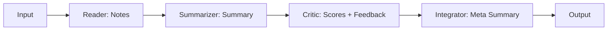
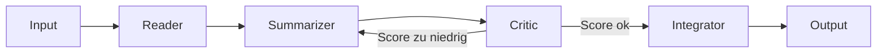

# Multi-Agent Paper Analyzer

Wir vergleichem drei Wege, denselben LLM-Workflow zu steuern:
- LangChain (linear)
- LangGraph (Graph mit einer einfachen Entscheidung)
- DSPy (deklarativ, optional mit Teleprompting)

Ablauf ist immer gleich:
Reader → Summarizer → Critic → Integrator

Wir wollen sehen, was sich ändert, wenn nur das Orchestrierungs-Framework geändert wird.

---

## Setup

### Voraussetzungen
- Python 3.9+
- OpenAI API Key (oder ein lokales Modell, falls vorhanden)

### Installation
```bash
python -m venv venv
source venv/bin/activate    # Windows: venv\Scripts\activate
pip install -r requirements.txt
cp .env.example .env        # OPENAI_API_KEY eintragen
```

### Start
```bash
python -m streamlit run app/app.py
```

**Optional:**
- Windows: `scripts/launchers/run.bat`
- Mac/Linux: `scripts/launchers/run.sh`

---

## Kurzüberblick

1. PDF oder TXT hochladen
2. Pipeline wählen (LangChain, LangGraph, DSPy)
3. Start drücken

App liefert vier Artefakte:
- **Notes** (Reader)
- **Summary** (Summarizer)
- **Review** (Critic: Scores + Hinweise)
- **Meta Summary** (Integrator)

---

## Drei Pipelines

### LangChain

LangChain läuft Schritt für Schritt durch.



### LangGraph

LangGraph nutzt einen Graphen.
Critic kann einen zweiten Versuch auslösen. Wir erlauben maximal eine Schleife.



### DSPy

DSPy beschreibt die Pipeline über Signaturen.
Optional optimiert DSPy die Prompts mit einem kleinen Dev-Set.

Ohne Teleprompting läuft DSPy wie eine normale Pipeline.
Mit Teleprompting sieht man den Unterschied im Ergebnis und in der Laufzeit.

---

## Was wir messen

Metriken bewusst schlank. Das reicht für den Vergleich.

### Laufzeit
- Gesamtzeit
- Zeit pro Agent (Reader, Summarizer, Critic, Integrator)

### Qualität (über den Critic)
- Coherence
- Groundedness
- Coverage
- Specificity

### Robustheit
- LangGraph: `loop_count` (0 oder 1)
- DSPy-Optimierung (optional)
  - Base vs Optimized
  - Gain als Durchschnitt der Critic-Scores

---

## Ordnerstruktur

- `app/app.py` – Streamlit UI
- `app/agents/` – Reader, Summarizer, Critic, Integrator
- `app/workflows/` – LangChain, LangGraph, DSPy
- `app/llm.py` – Setup vom LLM
- `app/telemetry.py` – Logs (Timing, Scores)
- `app/utils.py` – Vorverarbeitung (PDF-Cleanup)
- `dev-set/` – Beispiele für DSPy Teleprompting

**Dokumente für den Workshop:**
- `docs/participants/START_HIER.md`
- `docs/participants/TEILNEHMER_SKRIPT.md`
- `docs/participants/CODE_EXPERIMENTE.md`

---

## Workshop

**Startpunkt:**
- `docs/participants/START_HIER.md`
