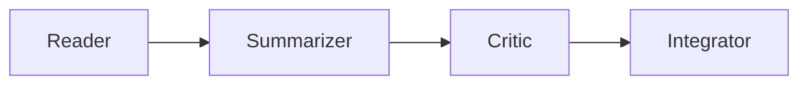
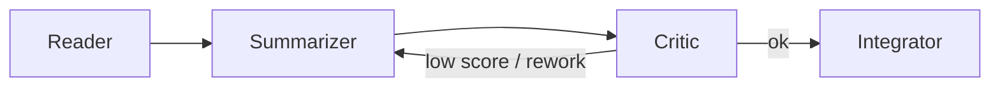

# Projekt Erklärung: Multi Agent Paper Analyzer

## Projektüberblick

Wir analysieren wissenschaftliche Texte mit vier spezialisierten Agenten:
- **Reader** liest das Dokument und extrahiert Notizen.
- **Summarizer** fasst die wichtigsten Aussagen zusammen.
- **Critic** bewertet, wie gut die Zusammenfassung ist.
- **Integrator** erstellt eine Meta-Zusammenfassung aus allem.

Der Workflow läuft in drei Frameworks:
- **LangChain**: Simple, sequenzielle Schritte.
- **LangGraph**: Graph-basierte Steuerung und Visualisierung.
- **DSPy**: Deklarativ und automatisch optimierend (optional mit Teleprompting).

## Agenten-Pipeline (konzeptionell)

**LangChain (linear)**

**LangGraph (Graph + Conditional Edges)**

Hinweis: Der reale Graph im Projekt enthält zusätzliche Nodes (Translator/Keyword/Quality/Judge/Aggregator) und erzeugt `graph_dot` zur Visualisierung (`app/workflows/langgraph_pipeline.py`).

**DSPy (deklarativ via Signatures)**
- DSPy arbeitet nicht primär mit „Prompt-Strings pro Step“, sondern mit `dspy.Signature` (Inputs/Outputs + Regeln). DSPy generiert die Prompts daraus automatisch und kann sie via Teleprompting optimieren (`app/workflows/dspy_pipeline.py`).

## Framework-Vergleich (Trade-offs)

| Framework | Paradigma | Vorteile | Nachteile | Beispiel im Projekt |
|---|---|---|---|---|
| LangChain | Sequenziell | Einfach, gut für Einsteiger | Kein Conditional Flow / Looping | `app/workflows/langchain_pipeline.py:run_pipeline()` |
| LangGraph | Graph-based | Conditional Edges, visualisierbar, erweiterbar | Mehr Boilerplate (State + Routing) | `app/workflows/langgraph_pipeline.py:_build_langgraph_workflow()` |
| DSPy | Deklarativ / Self-Improving | Signatures + (optional) automatische Prompt-Optimierung | Braucht Dev-Set, oft höhere Latenz | `app/workflows/dspy_pipeline.py` (`dspy.Signature`, `run_pipeline()`) |

## Mini-Beispielausgabe (Form der Ergebnisse)

| Framework | Ergebnis-Felder (Auszug) | Projekt-spezifische Extras |
|---|---|---|
| LangChain | `structured`, `summary`, `critic`, `meta`, `latency_s`, `reader_s`… | — |
| LangGraph | `structured`, `summary`, `critic`, `meta`, `latency_s`, `reader_s`… | `summary_translated`, `keywords`, `critic_loops`, `graph_dot` |
| DSPy | `structured`, `summary`, `critic`, `meta`, `latency_s`, `reader_s`… | `dspy_available` (+ optional Teleprompting) |

## Designentscheidungen

### Warum mehrere Agenten?

Ein großer Prompt ist schwer zu kontrollieren. Mit einzelnen Agenten bleibt jede Aufgabe klar getrennt. Das erleichtert das Debugging. Es erleichtert auch die Anpassung.

### Warum drei Frameworks?

LangChain geht schnell. Es bleibt übersichtlich. LangGraph zeigt den Ablauf als Graph. Es lässt sich besser erweitern. DSPy übernimmt Optimierungsschritte automatisch. Es nutzt Signaturen.

So lernen Teilnehmer verschiedene Stile kennen. Sie entscheiden, welcher Ansatz zu ihrer Idee passt.

### Warum Streamlit?

Streamlit startet mit einem Befehl. Es zeigt Uploads, Buttons und Vergleiche direkt im Browser. Es macht die Arbeit interaktiv.

### Warum Text-Vorverarbeitung?

PDFs enthalten oft störende Elemente. Beispiele sind Metadaten, Literaturverzeichnisse und seltsame Zeilenumbrüche. Die Datei `utils.py` normalisiert den Text. So arbeiten die Agenten sauber.

### Warum Telemetrie?

Die Datei `telemetry.py` schreibt Laufzeiten und Textlängen in eine CSV. So kann man sehen, welche Pipeline schneller ist. Man sieht auch, wie groß die Outputs werden.

### Warum Doppelklick-Start?

Die Dateien `run.bat` und `run.sh` übernehmen das Setup. Sie installieren pip. Sie konfigurieren `.env`. Sie starten Streamlit. Das ist für Workshop-Teilnehmer der einfachste Weg.
